# Hi, I'm Mohammad Aamir 👋

<picture>
  <source media="(prefers-color-scheme: dark)" srcset="./dark.svg">
  <source media="(prefers-color-scheme: light)" srcset="./light.svg">
  
</picture>

  <b>Java Backend Developer · Spring Boot · Spring Security · REST APIs</b>

  ☕ Java &nbsp;·&nbsp; 🔐 Spring Security &nbsp;·&nbsp; 🌐 REST APIs &nbsp;·&nbsp; 🗄️ MySQL &nbsp;·&nbsp; ⚛️ React

I'm a **second-year B.Sc. Information Technology student** focused on Java backend development. I learn by building practical applications and strengthening my understanding of **Java, Spring Boot, Spring Security, REST APIs, JPA/Hibernate, and MySQL**.

I'm working toward an entry-level **Java Backend Developer** role or internship and continuously improving my coding, debugging, and problem-solving skills.

---

## ☕ What I Build

- **Java backend applications** — clean REST APIs and CRUD workflows
- **Authentication and authorization** — Spring Security, JWT, and role-based access
- **Database-driven features** — Spring Data JPA, Hibernate, and MySQL
- **Reliable API behaviour** — validation, exception handling, searching, and filtering
- **Full-stack project integration** — connecting a React frontend to a Spring Boot backend

---

## 🧩 Featured Projects

### 🎫 Customer Support CRM

[GitHub Repository](https://github.com/Aamirkhan-04/customer-support-crm)

A customer support ticketing application for working with customers and their support tickets.

- Create and search tickets; filter and update ticket status
- Add comments/notes to ticket conversations
- JWT authentication and role-based access
- Validation and structured error handling
- **Java · Spring Boot · Spring Security · JWT · Spring Data JPA · Hibernate · MySQL · React**

### 🐞 Bug Tracking System — Planned Next

A Java backend project planned around bug reporting and tracking workflows.

- Planned stack: **Java · Spring Boot · Spring Security · JWT · MySQL**
- This project is planned for continued development; it is not presented as a completed project

### 🏥 Hospital Backend

A backend project built around hospital/healthcare application workflows.

- REST API development using Java and Spring Boot
- MySQL persistence
- Built as a learning project alongside a frontend application

### 🎓 Student Course Portal

A student/course management learning project with a MySQL database.

---

## 🛠️ Engineering Stack

### ☕ Backend
`Java` `Spring Boot` `Spring Security` `REST APIs` `Spring Data JPA` `Hibernate` `JWT`

### 🗄️ Database
`MySQL` `SQL`

### 🎨 Frontend
`HTML` `CSS` `JavaScript` `React (project experience)`

### 🧰 Tools
`Git` `GitHub` `Postman` `VS Code` `Spring Tool Suite (STS)`

---

## 🎯 Current Focus

- Improving Java fundamentals and interview-style coding logic
- Understanding Spring Security authentication and authorization flows
- Building secure, maintainable REST APIs
- Practising debugging, validation, exception handling, and database relationships

---

## 🎓 Education & Career Goal

- **Education:** Second year of B.Sc. Information Technology
- **Career goal:** Java Backend Developer
- **Opportunity:** Open to suitable fresher roles and internships

---

## 📫 Connect With Me

- 💻 [GitHub](https://github.com/Aamirkhan-04)
- 🌐 [Portfolio](https://mohammad-aamir-khan.netlify.app)
- 📧 [Email](mailto:khanaamir129845@gmail.com)

---

  <b>Build consistently. Learn the fundamentals. Improve with every project. ☕</b>

